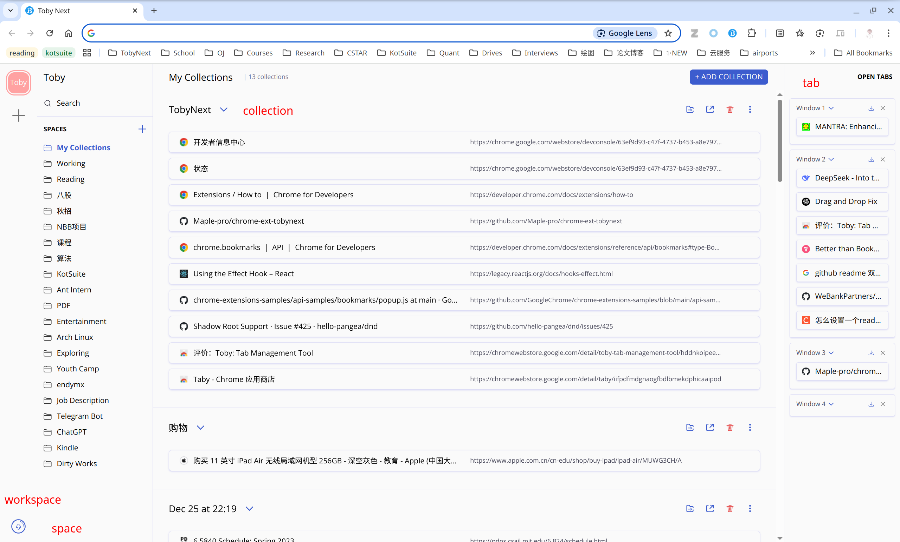

# 📌 TobyNext - 让你的浏览器标签管理更高效

[English](./README.md) | 中文

👉 安装 [TobyNext](https://chromewebstore.google.com/detail/toby-next/nmoefidlkpebfihkgoibgcfaehpefebe?authuser=0&hl=zh-CN)

👉 [官方文档](https://sites.maples31.com/tobynext/)

## 🌟 你是否常常因为打开太多标签页而头疼？

工作时打开一堆网页，想保存当前进度，下次接着用？

使用书签太麻烦，想要更直观、高效的方式管理工作区？

🚀 TobyNext 让你的 新标签页变身生产力神器！

一键保存 & 一键恢复 你的浏览器工作区，让你的工作流更加流畅！

## 🎯 TobyNext 是什么？
TobyNext 是一款 浏览器新标签页扩展，专为管理大量的浏览器标签页而设计。

💾 一键保存：将当前所有标签页存为 工作区，随时恢复，无需重复打开。

🔄 一键恢复：想继续上次的任务？只需点击一下，即可恢复完整工作环境。

📂 灵活分类：支持多个 工作空间，不同项目、不同任务轻松切换。

## 💡 为什么选择 TobyNext？
相比传统书签，TobyNext 提供更直观、更高效的标签管理方式：

✅ 书签用于保存重点网址，TobyNext 用于管理你的整个工作区。

✅ 拖拽管理，快速整理你的标签，而不是让它们杂乱无章。

✅ 可视化界面，比书签栏更直观，查找和恢复更方便。

## 🔒 数据安全 & 跨设备同步
TobyNext 不会存储你的任何数据，所有标签页都保存在 Chrome 书签目录中，确保数据安全 & 隐私。

✔ 无需额外注册，所有数据都跟随 Chrome 账号同步，跨设备无缝使用！

✔ 本地存储，安全可靠，你掌控自己的数据，无需担心云端泄露。

## 🔄 从 Toby 轻松切换到 TobyNext
如果你是 Toby 的用户，你可以通过 TobyNext 左下角的导入功能，一键导入你的 Toby 数据，无缝衔接你的标签管理体验！💼✨

---

💻 立即体验 TobyNext，告别标签页混乱，提升你的工作效率！

👉 安装 [TobyNext](https://chromewebstore.google.com/detail/toby-next/nmoefidlkpebfihkgoibgcfaehpefebe?authuser=0&hl=zh-CN)
