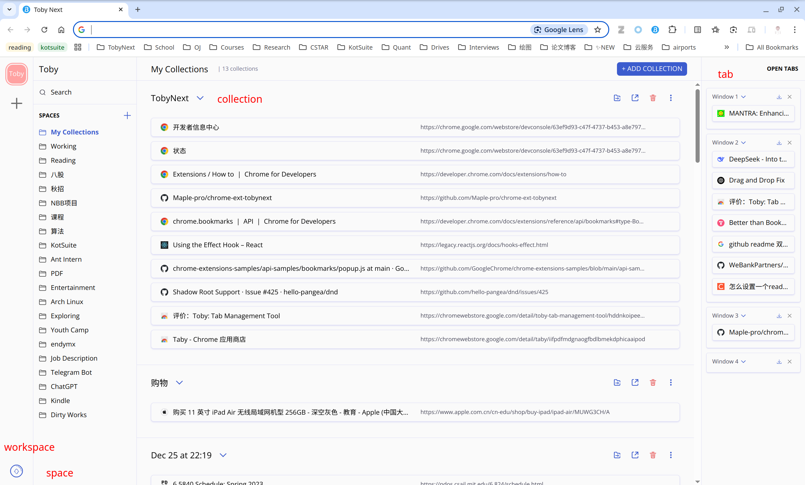

# 📌 TobyNext - Manage Your Browser Tabs Smarter

English | [中文](./README-cn.md)

👉 Install [TobyNext](https://chromewebstore.google.com/detail/toby-next/nmoefidlkpebfihkgoibgcfaehpefebe?authuser=0&hl=zh-CN)

👉 [Documentation](https://sites.maples31.com/tobynext/)

## 🌟 Struggling with too many open tabs?
You need multiple web pages for work, but managing them is a nightmare?

Bookmarks feel too clunky, and you wish for a more efficient workspace management tool?

🚀 TobyNext transforms your New Tab Page into a productivity powerhouse!

Save & restore entire work sessions with just one click!

## 🎯 What is TobyNext?
TobyNext is a browser extension designed to help you efficiently manage multiple tabs.

💾 One-Click Save: Store all your open tabs as a workspace and resume later.

🔄 One-Click Restore: Pick up right where you left off with a single click.

📂 Organized Workspaces: Easily switch between different projects and tasks.

## 💡 Why Choose TobyNext?
Compared to traditional bookmarks, TobyNext offers a more intuitive and efficient way to manage tabs:

✅ Bookmarks are for key websites, but TobyNext manages entire work sessions.

✅ Drag & drop interface, keeping your tabs organized effortlessly.

✅ Visual layout, making it easier to locate and restore workspaces.

## 🔒 Secure & Sync Across Devices
TobyNext does not store any of your data—all tabs are saved in the Chrome Bookmarks folder, ensuring privacy and security.

✔ No extra sign-up needed, your data syncs seamlessly with your Chrome account.

✔ Local storage, fully secure, giving you full control over your information.

## 🔄 Seamlessly Import from Toby
If you're a Toby user, you can import your Toby data effortlessly via the import option in the bottom-left corner of TobyNext. Switch over smoothly without losing your saved sessions! 💼✨

---

💻 Try TobyNext today and take control of your tab chaos!

👉 Install [TobyNext](https://chromewebstore.google.com/detail/toby-next/nmoefidlkpebfihkgoibgcfaehpefebe?authuser=0&hl=zh-CN)
## Development

The current source targets Chrome 134+ with Manifest V3 and CRXJS 2.x. See [development notes](docs/DEVELOPMENT.md) for setup, development and debugging, architecture, tests, Chrome Web Store packaging, and troubleshooting.
